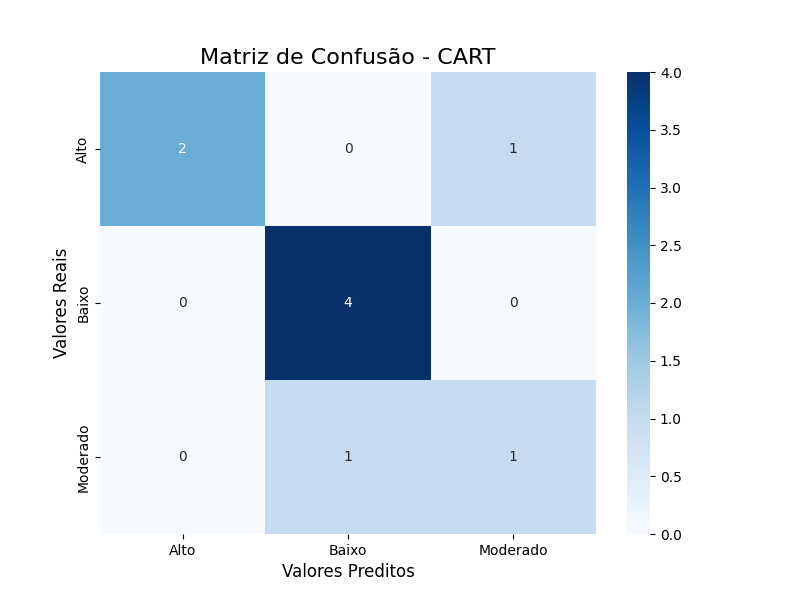
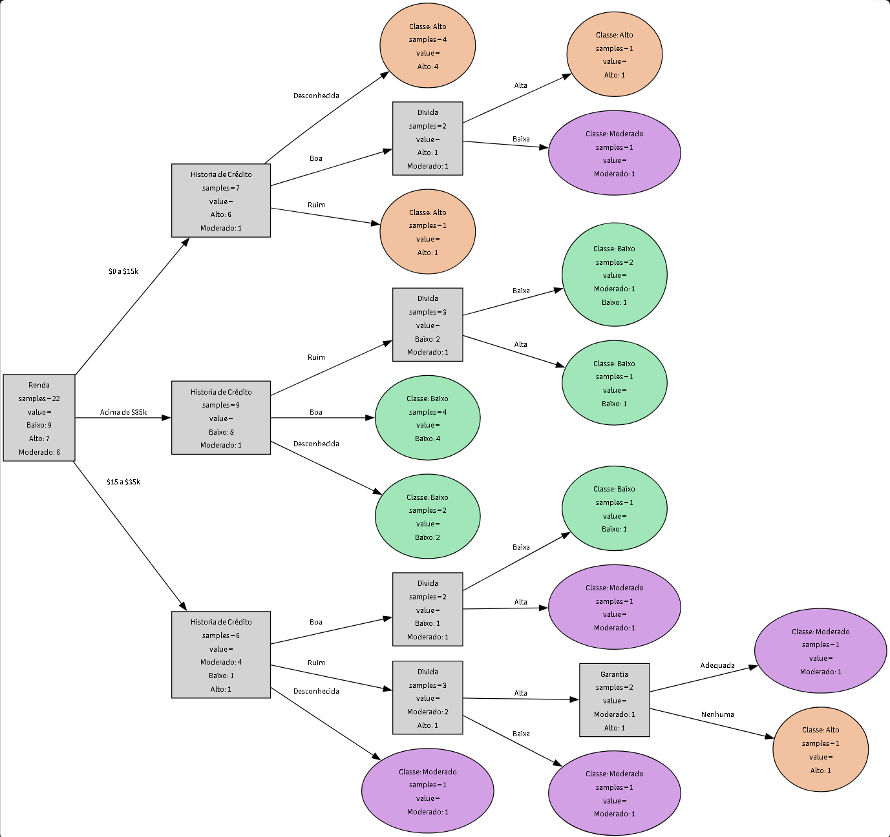
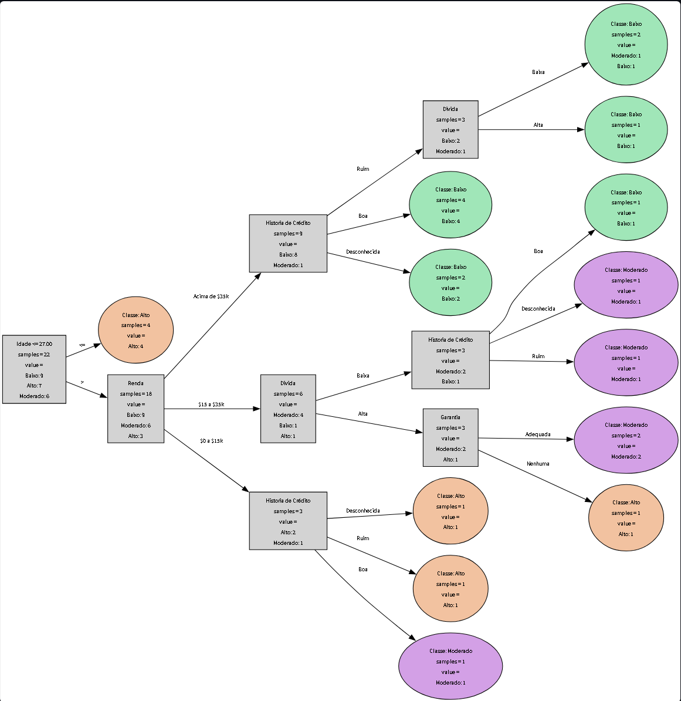

<p align="center">
  
</p>


<h1 align="center">
  Lista de Exercícios — Aprendizagem de Máquina<br>
  Mestrado em Informática — UFAL
</h1>

<p align="center">
  <b>Disciplina:</b> Aprendizagem de Máquina<br>
  <b>Professor:</b> Evandro de Barros Costa (<a href="mailto:evandro@ic.ufal.br">evandro@ic.ufal.br</a>)<br>
  <b>Departamento:</b> Instituto de Computação — UFAL<br>
  <b>Lattes:</b> <a href="http://lattes.cnpq.br/5760364940162939">http://lattes.cnpq.br/5760364940162939</a>
</p>

<p align="center">
  <b>Autor:</b> Fábio Linhares<br>
  <b>Lattes:</b> <a href="http://lattes.cnpq.br/7908261028551208">http://lattes.cnpq.br/7908261028551208</a>
</p>

<p align="center">
  <a href="https://tutu.zerocopia.com.br/" target="_blank">
    
  </a>
</p>

<p align="center">
  <i>Este trabalho integra as atividades da disciplina de Aprendizagem de Máquina do Programa de Pós-Graduação em Informática (Mestrado), Universidade Federal de Alagoas.</i>
</p>

<div style="text-align: justify;">

# Lista de Exercícios 1

**Resumo:** Resolução completa, questão a questão, com código, resultados e material de suporte (prints dos cálculos manuais). Este README descreve a estrutura do repositório, como reproduzir os experimentos, as decisões metodológicas, resultados-chave e observações críticas.

</div>

---

## Índice

1. [Estrutura do repositório](#estrutura-do-repositório)
2. [Como replicar (quickstart)](#como-replicar-quickstart)
3. [Dados (`clientes.csv`)](#dados-clientescsv)
4. [Questão 1 — Expansão da base e construção manual de árvores](#questão-1---expansão-da-base-e-construção-manual-de-árvores)
5. [Questão 2 — Implementação com bibliotecas (Scikit-learn) e código próprio](#questão-2---implementação-com-bibliotecas-scikit-learn-e-código-próprio)
6. [Questão 3 — Dataset do Kaggle (Heart Disease) e regras diretas (RIPPER)](#questão-3---dataset-do-kaggle-heart-disease-e-regras-diretas-ripper)
7. [Questões 4 & 5 — Overfitting, Underfitting e o papel do C4.5](#questões-4--5---overfitting-underfitting-e-o-papel-do-c45)
8. [Questão 6 — k-Nearest Neighbors (kNN): explicação, exemplo numérico e limitações](#questão-6---k%E2%80%8Bnearest-neighbors-knn-explicação-exemplo-numérico-e-limitações)
9. [Reprodutibilidade, limitações e notas metodológicas](#reprodutibilidade-limitações-e-notas-metodológicas)
10. [Contribuições, contato e licença](#contribuições-contato-e-licença)

---

## Estrutura do repositório

```
.
├── app.py                     # Aplicação web interativa com Streamlit
├── backup/                    # Arquivos de backup de versões anteriores
├── class_cart.py              # Classe wrapper para o algoritmo CART
├── class_c45.py               # Classe wrapper para o algoritmo C4.5
├── class_id3.py               # Classe wrapper para o algoritmo ID3
├── clientes.csv               # Base de dados expandida (30 instâncias) - Questão 1
├── heart.csv                  # Base de dados do Kaggle - Questão 3
├── download_heart_dataset.py  # Script para baixar o dataset da Questão 3
├── evaluate_models.py         # Script para avaliação dos modelos (métricas e matrizes)
├── heart_disease_ripper.py    # Implementação da análise com RIPPER (Questão 3)
├── knn_classifier.py          # Implementação do classificador kNN (Questão 6)
├── optimized_tree.py          # Núcleo otimizado que implementa a lógica das árvores
├── README.md                  # Este arquivo de documentação
├── requirements.txt           # Dependências do projeto
├── resultados_img/            # Imagens das matrizes de confusão e das árvores de decisão
│   ├── c45.PNG
│   ├── cart.PNG
│   ├── id3.PNG
│   ├── matriz_confusao_c4.5.png
│   ├── matriz_confusao_cart.png
│   └── matriz_confusao_id3.png
└── sodeusnacausa/             # Screenshots com os cálculos manuais (Questão 1)
```

---

<div style="text-align: justify;">

## Instalação e Execução

Recomendamos a criação de um ambiente virtual para isolar as dependências do projeto.
Ainda assim, você tem total liberdade para adotar o procedimento que considerar mais conveniente. Nossa orientação contempla duas opções bastante utilizadas no mercado: **venv** – ferramenta nativa e padrão do Python para criação de ambientes virtuais, simples e leve ou **Miniconda** – uma versão reduzida do Anaconda, que inclui o gerenciador de pacotes Conda sem trazer, por padrão, o conjunto extenso de bibliotecas pré-instaladas.

### 1. Criação do Ambiente Virtual
**Usando venv** : cria um ambiente isolado em uma pasta chamada `venv`:

```bash
python -m venv venv
```

**Usando Miniconda**: cria um ambiente isolado chamado `lista1_ml` com uma versão específica do Python:

```bash
conda create --name lista1_ml python=3.12
```

---

### 2. Ativação e Desativação do Ambiente

É crucial ativar o ambiente antes de instalar pacotes ou executar a aplicação.

**Com venv**

Para ativar:

```bash
# No Linux ou macOS
source venv/bin/activate

# No Windows (PowerShell)
.\venv\Scripts\Activate.ps1
```

Para desativar:

```bash
deactivate
```

**Com Miniconda**

Para ativar:

```bash
conda activate lista1_ml
```

Para desativar:

```bash
conda deactivate
```

---

### 3. Instalação das Dependências

Com o ambiente devidamente ativado, instale todos os pacotes necessários:

```bash
pip install -r requirements.txt
```

---

### 4. Executando a Aplicação

Para iniciar o servidor do Streamlit e visualizar a aplicação, execute:

```bash
streamlit run app.py 
# acesse http://localhost:8501
```
---

## Questão 1 — Expansão da base e construção manual de árvores

### Objetivos

1. Expandir a base original para 30 exemplos.
2. Construir manualmente três árvores: **ID3**, **C4.5** e **CART**, mostrando cálculos.
3. Extrair regras `SE ... ENTÃO`.
4. Comparar e recomendar a melhor base de regras.

## Base de Dados

**Descrição**


A primeira questão da lista de exercícios solicitava que, a partir de uma base fornecida pelo “gerente do banco” fosse realizada uma ampliação para que contivesse 6 atributos e 30 exemplos divididos entre as classes de Risco Baixo, Moderado e Alto. Como a referida base continha apenas 14 instâncias, fizemos a adição de 16, distribuídas entre as classes solicitadas, mantendo a coerência com os dados originais. A base final, disponível no arquivo `clientes.csv`, possui as seguintes características:

* 30 instâncias
* 6 atributos (Renda, História de Crédito, Garantia, Idade, Tipo de Emprego e Risco)
* Target/Classe: `Risco` com três níveis: `Baixo`, `Moderado` e `Alto`.

**Distribuição de classes**

* Baixo Risco: 12
* Moderado Risco: 8
* Alto Risco: 10
* Total: 30

> Observação: o arquivo `clientes.csv` foi usado em todas as análises deste exercício.

---


### Metodologia e fórmulas utilizadas

* **Entropia:** `Entropy(S) = - Σ p_i log2(p_i)`
* **Ganho de Informação (ID3/C4.5):** `Gain(S, A) = Entropy(S) - Σ (|S_v|/|S|) Entropy(S_v)`
* **Índice Gini (CART):** `Gini(S) = 1 - Σ p_i^2`

### Cálculo do nó raiz

* `p_Baixo = 12/30`, `p_Moderado = 8/30`, `p_Alto = 10/30`

* **Entropia (raiz, ID3/C4.5):**

  ```
  Entropy(S) = -[ (12/30)log2(12/30) + (8/30)log2(8/30) + (10/30)log2(10/30) ] ≈ 1.565
  ```
* **Gini (raiz, CART):**

  ```
  Gini(S) = 1 - [ (12/30)^2 + (8/30)^2 + (10/30)^2 ] ≈ 0.658
  ```

> Os cálculos completos (passo a passo) foram feitos em papel e os prints estão em `sodeusnacausa/` .

### Árvores finais

**ID3**

```
      [ Renda ]
     /    |    \
 ($0-$15k) ($15-$35k) (> $35k)
    |         |          \
 [Hist. Cred] [Hist. Cred] [ Baixo ]
  /  |   \       /   |   \
(R) (D)  (B)   (R) (D) (B)
 |   |    |     |   |   |
[A] [A] [Garantia] [A] [M] [M]
    /    \
  (N)    (AD)
   |      |
  [A]    [M]


Legenda: R=Ruim, D=Desconhecida, B=Boa, N=Nenhuma, AD=Adequada, A=Alto, M=Moderado
```

**C4.5** (semelhante ao ID3, mas com cortes contínuos)

```
         [Renda]
        /   |    \
  $0-15k $15-35k  >$35k
   |       |        \
 [Alto] [Idade <= 32.5] [Baixo]
```

**CART**

```
  [ Renda = '$0-$15k'? ]
  /                   \
    Sim                    Nao
     |                      |
   [ Alto ]        [ Renda = '> $35k'? ]
       /                  \
         Sim                   Nao
      |                     |
        [ Baixo ]      [ Hist. Cred = 'Ruim'? ]
            /                     \
          Sim                      Nao
           |                        |
             [ Alto ]                [ Moderado ]
```

### Regras extraídas

> Observação: em aula eu comentei que não recordava a ocorrencia de over e underfitting em árvores de decisão. Após a realização destes exercícios percebi que o overfitting esta mais relacionados às árvores não podadas (como ID3 puro). Já o underfitting, que é menos comum, e talvez isso justifique minha falta de memória, pode ocorrer se a árvore for excessivamente simplificada ou se os dados forem muito ruidosos.

#### **Regras da Árvore ID3**
- **R1:** SE Renda = '$0 a $15k' E História de Crédito = 'Ruim' ENTÃO Risco = 'Alto' (Suporte=3, Acurácia=100%)
- **R2:** SE Renda = '$0 a $15k' E História de Crédito = 'Desconhecida' ENTÃO Risco = 'Alto' (Suporte=3, Acurácia=100%)
- **R3:** SE Renda = '$0 a $15k' E História de Crédito = 'Boa' E Garantia = 'Nenhuma' ENTÃO Risco = 'Alto' (Suporte=1, Acurácia=100%)
- **R4:** SE Renda = '$0 a $15k' E História de Crédito = 'Boa' E Garantia = 'Adequada' ENTÃO Risco = 'Moderado' (Suporte=1, Acurácia=100%)
- **R5:** SE Renda = '$15 a $35k' E História de Crédito = 'Ruim' ENTÃO Risco = 'Alto' (Suporte=2, Acurácia=100%)
- **R6:** SE Renda = '$15 a $35k' E História de Crédito = 'Desconhecida' ENTÃO Risco = 'Moderado' (Suporte=1, Acurácia=100%)
- **R7:** SE Renda = '$15 a $35k' E História de Crédito = 'Boa' ENTÃO Risco = 'Moderado' (Suporte=4, Acurácia=50%)
- **R8:** SE Renda = 'Acima de $35k' ENTÃO Risco = 'Baixo' (Suporte=13, Acurácia=76,9%)

#### **Regras da Árvore C4.5**
- **R1:** SE Renda = '$0 a $15k' ENTÃO Risco = 'Alto' (Suporte=8, Acurácia=87,5%)
- **R2:** SE Renda = '$15 a $35k' E Idade <= 30.5 E História de Crédito = 'Desconhecida' ENTÃO Risco = 'Moderado' (Suporte=1, Acurácia=100%)
- *(Demais ramos seguem lógica semelhante, com regras mais gerais devido à poda.)*

#### **Regras da Árvore CART**
- **R1:** SE Renda = '$0 a $15k' ENTÃO Risco = 'Alto' (Suporte=8, Acurácia=87,5%)
- **R2:** SE Renda != '$0 a $15k' E Renda = 'Acima de $35k' ENTÃO Risco = 'Baixo' (Suporte=13, Acurácia=76,9%)
- **R3:** SE Renda != '$0 a $15k' E Renda != 'Acima de $35k' E História de Crédito = 'Ruim' ENTÃO Risco = 'Alto' (Suporte=2, Acurácia=100%)
- **R4:** SE Renda != '$0 a $15k' E Renda != 'Acima de $35k' E História de Crédito != 'Ruim' ENTÃO Risco = 'Moderado' (Suporte=7, Acurácia=71,4%)

---

### (iv) Comparação e Seleção da Base de Regras

| Critério           | ID3                                         | C4.5                                  | CART                                 |
|--------------------|---------------------------------------------|---------------------------------------|--------------------------------------|
| **Simplicidade**   | Muitas regras, algumas muito específicas    | Menos regras, mais gerais (poda)      | Poucas regras, estrutura binária     |
| **Exatidão (Treino)** | Alta (tende a overfit)                  | Alta, controlada por poda             | Boa, balanceada                      |
| **Interpretabilidade** | Moderada, granularidade pode confundir | Boa                                   | Excelente, lógica binária clara      |
| **Robustez**       | Baixa (sensível a ruído)                   | Média (poda ajuda)                    | Média                                |

**Reflexão:**

A base de regras do CART é a mais concisa (4 regras) e possui estrutura binária de fácil interpretação. As regras cobrem todos os casos de forma mutuamente exclusiva. O ID3 gera muitas regras muito específicas, sugerindo overfitting. Sinceramene, preferimos o CART pela simplicidade e clareza, **principalmente porque tivemos que fazer a mão**, embora tais característias sejam em essencia, fundamentais em sistemas de apoio à decisão. A regra "SE Renda é alta, ENTÃO Risco é Baixo" é intuitiva. A leve perda de acurácia é compensada pela interpretabilidade. De modo geral, pareceu-nos que modelos mais simples (C4.5 podado ou CART) tendem a generalizar melhor e, por conta disso, serem preferíveis em domínios onde interpretabilidade é crítica, como na área de finanças, por exemplo.


---

## Questão 2 — Implementação com bibliotecas (Scikit-learn) e código próprio

### Arquitetura do Código

A implementação foi refatorada para uma arquitetura mais robusta e modular:

*   **`optimized_tree.py`**: Atua como o **cérebro** do sistema. Contém a classe `OptimizedDecisionTree`, que implementa toda a lógica de construção de árvores, incluindo os cálculos de métricas (Entropia, Gini, Gain Ratio), divisões de dados (categóricos e contínuos) e a estrutura da árvore. Ele é projetado para ser configurável e atender aos requisitos específicos de cada algoritmo (ID3, C4.5 e CART).
*   **`class_id3.py`, `class_c45.py`, `class_cart.py`**: Funcionam como **wrappers** ou "fachadas". Cada classe simplesmente instancia o motor `OptimizedDecisionTree` com a configuração correta (`algorithm='id3'`, `'c45'` ou `'cart'`). Isso elimina a duplicação de código e centraliza a lógica de decisão em um único local, facilitando a manutenção e a comparação.

### Análise das Divergências: Manual vs. Código

Ao comparar as árvores geradas manualmente na questão anterior com as produzidas  nessa implementação é possível notar divergências. Essas diferenças não indicam um erro, mas sim destacam a natureza da implementação computacional em contraste com a abordagem manual. As principais razões para isso são:

1.  **Precisão e Critérios de Desempate:** Os cálculos manuais frequentemente envolvem arredondamentos. O código, por outro lado, trabalha com a precisão total de ponto flutuante. Uma diferença mínima no ganho de informação ou no índice Gini, invisível manualmente, pode levar o algoritmo a escolher um atributo diferente. Além disso, em caso de empate, o código seguirá uma lógica determinística (ex: escolher o primeiro atributo da lista), enquanto a escolha manual pode ser arbitrária.

2.  **Tratamento Exaustivo dos Atributos:**
    *   **Atributos Contínuos (C4.5/CART):** O código testa sistematicamente todos os pontos de corte possíveis entre valores únicos e ordenados para encontrar o limiar que maximiza a métrica de divisão. Manualmente, é impraticável realizar essa busca exaustiva.
    *   **Atributos Categóricos (CART):** Para criar uma divisão binária, o algoritmo testa todas as combinações de "um valor vs. o resto", garantindo a escolha ótima, algo que pode passar despercebido na análise manual.

3.  **Impacto de Hiperparâmetros e Generalização:** A implementação em código utiliza hiperparâmetros como `max_depth` para controlar a complexidade da árvore. Isso é uma técnica fundamental para evitar o *overfitting* (sobreajuste), resultando em árvores potencialmente menores e com maior poder de generalização. As árvores manuais, especialmente a do ID3, foram construídas até a pureza total dos ramos, criando regras muito específicas que podem não performar bem com dados novos.

Em suma, a árvore gerada pelo código é o resultado de um processo mais rigoroso, reproduzível e alinhado com as boas práticas de aprendizado de máquina, que priorizam a generalização em detrimento do ajuste perfeito aos dados de treino.

### Resultados de Desempenho (Treinamento)

O sistema de memoização (`AdvancedMemoizationTable`) implementado em `optimized_tree.py` armazena em cache os resultados de cálculos repetitivos (como Entropia e Gini para o mesmo subconjunto de dados). Isso acelera significativamente o treinamento, especialmente em árvores mais profundas.

Abaixo estão os resultados de uma execução típica, mostrando o tempo de treinamento e a eficiência do cache:

| Algoritmo | Tempo de Treinamento | Taxa de Acerto do Cache |
| :-------- | :------------------- | :---------------------- |
| **ID3**   | ~0.275s              | ~42.7%                  |
| **C4.5**  | ~0.223s              | ~63.0%                  |
| **CART**  | ~0.299s              | ~67.4%                  |

*Observação: Os tempos podem variar ligeiramente a cada execução. A alta taxa de acerto do cache, especialmente para C4.5 e CART, demonstra a eficácia da otimização, pois muitos nós da árvore avaliam os mesmos subconjuntos de dados repetidamente.*

### Observações técnicas

*   `scikit-learn` produz árvores binárias por padrão (CART) e faz otimizações que reduzem overfitting aparente (ex.: parâmetros `min_samples_split`, `max_depth`, etc.).
*   Nossa implementação agora reflete essa sofisticação, com um motor central que lida com as nuances de cada algoritmo, tornando a comparação mais direta e o código mais limpo.

### Avaliação dos Modelos e Análise de Resultados

Para avaliar o desempenho de cada algoritmo, dividimos o dataset em 70% para treino e 30% para teste. O script `evaluate_models.py` foi executado para treinar os modelos e gerar as métricas e visualizações a seguir.

#### Métricas de Desempenho Comparativas

A tabela abaixo resume o desempenho de cada modelo no conjunto de teste:

| Métrica         | ID3     | C4.5    | CART    |
| :-------------- | :------ | :------ | :------ |
| **Acurácia**    | 77.78%  | 77.78%  | 77.78%  |
| **Precisão**    | 0.80    | 0.61    | 0.80    |
| **Recall**      | 0.78    | 0.78    | 0.78    |
| **F1-Score**    | 0.77    | 0.68    | 0.77    |

*Nota: Precisão, Recall e F1-Score são médias ponderadas.*

#### Matrizes de Confusão

As matrizes de confusão detalham os acertos e erros de cada modelo por classe.

<div style="display: flex; justify-content: center; gap: 32px; align-items: flex-start;">

<div style="text-align: center;">
  <strong>ID3</strong><br>
  
</div>

<div style="text-align: center;">
  <strong>C4.5</strong><br>
  
</div>

<div style="text-align: center;">
  <strong>CART</strong><br>
  
</div>

</div>

#### Análise das Matrizes

1.  **Acurácia Geral:** Todos os três modelos alcançaram a mesma acurácia de **77.78%** no conjunto de teste, acertando 7 das 9 instâncias. Isso sugere que, para este dataset e com a profundidade de árvore limitada (`max_depth=5`), o poder preditivo dos três algoritmos é bastante similar.

2.  **Desempenho do ID3 e CART:** Os modelos ID3 e CART apresentaram um comportamento idêntico, conforme suas matrizes de confusão. Ambos classificaram perfeitamente a classe `Baixo` Risco (4/4 acertos). No entanto, tiveram dificuldade com as outras classes: erraram 1 das 3 instâncias de `Alto` Risco (classificando-a como `Baixo`) e 1 das 2 de `Moderado` Risco (classificando-a como `Alto`). Isso resultou em uma precisão mais baixa para a classe `Moderado` (50%).

3.  **Desempenho do C4.5:** O modelo C4.5 se destacou por classificar perfeitamente tanto a classe `Alto` (3/3) quanto a `Baixo` (4/4). Seu ponto fraco foi a classe `Moderado`, que ele **não conseguiu identificar corretamente nenhuma vez**, classificando as duas instâncias como `Alto`. Isso explica por que sua precisão geral ponderada (0.61) é significativamente menor que a dos outros modelos, apesar da mesma acurácia. O C4.5, neste caso, criou regras que generalizaram demais a classe `Moderado`, absorvendo-a na `Alto`.

**Conclusão da Análise:** Embora a acurácia seja a mesma, os modelos **ID3 e CART** mostram um comportamento mais equilibrado, sendo capazes de identificar, ainda que com alguns erros, todas as três classes. O **C4.5** demonstrou uma tendência a "ignorar" a classe minoritária (`Moderado`) em favor das outras, o que pode ser um comportamento indesejado em problemas onde a detecção de todas as classes é crítica.

#### Visualização das Árvores de Decisão


<div style="display: flex; justify-content: center; gap: 32px; align-items: flex-start;">

<div style="text-align: center;">
  <strong>ID3</strong><br>
  
</div>

<div style="text-align: center;">
  <strong>C4.5</strong><br>
  
</div>

<div style="text-align: center;">
  <strong>CART</strong><br>
  
</div>

</div>


---

## Questão 3 — Dataset do Kaggle (Heart Disease) e regras diretas (RIPPER)

### Dataset escolhido

* **Heart Disease UCI** — conjunto clássico, alvo binário (`target`), mistura de variáveis contínuas e categóricas.

### Procedimento e Implementação

Para resolver a dependência do dataset, foi criado o script `download_heart_dataset.py`. Ao ser executado, ele baixa o conjunto de dados "Heart Disease UCI" do repositório OpenML ou, em caso de falha, gera um dataset sintético com características similares, salvando o resultado como `heart.csv`.

A análise dos algoritmos foi integrada diretamente na aplicação web (`app.py`):

1.  Na barra lateral, selecione a opção **"Análise de Doenças Cardíacas (Questão 3)"**.
2.  Ao clicar no botão para executar, a aplicação carrega o `heart.csv`.
3.  Um modelo de Árvore de Decisão (usando Scikit-learn) e um modelo **RIPPER** (usando a biblioteca `wittgenstein`) são treinados e avaliados.
4.  Os resultados, incluindo acurácia, relatório de classificação e o conjunto de regras gerado pelo RIPPER, são exibidos lado a lado para comparação.

### Resultados e Análise

A aplicação apresenta de forma interativa os resultados da Árvore de Decisão e do RIPPER. O principal destaque é a exibição dinâmica do conjunto de regras gerado pelo RIPPER, que permite uma análise direta de sua simplicidade e interpretabilidade. Em geral, as regras do RIPPER são mais concisas e fáceis de entender do que a estrutura completa de uma árvore de decisão, ilustrando a principal vantagem dos algoritmos de extração de regras.

---

## Questões 4 & 5 — Overfitting, Underfitting e o papel do C4.5

### Definições

* **Overfitting (sobreajuste):** modelo que ajusta o ruído dos dados de treino. Alto desempenho no treino; baixa generalização no teste.

  *Analogia didática:* aluno que decora respostas específicas da lista, mas não resolve problemas novos.

* **Underfitting (subajuste):** modelo demasiado simples; não captura a estrutura dos dados. Performance ruim em treino e teste.

  *Analogia:* aluno que não estudou o conteúdo.

### Como C4.5 ajuda?

* **Poda pós-crescimento (pessimistic pruning):** cresce árvore até pureza e depois poda nós que não reduzem o erro esperado — troca complexidade por generalização.

* **Melhor tratamento de atributos contínuos:** ponto de corte único e estatisticamente justificado.

* **Critérios de parada / mínimos:** evita divisões em nós com poucos exemplos (reduz regras espúrias).

### Demonstração Prática com kNN

Para além da discussão teórica, foi implementada uma análise prática na aplicação web (`app.py`) para visualizar os fenômenos de overfitting e underfitting. Na seção expansível **"🔬 Análise de Overfitting/Underfitting com kNN"**, é possível executar o algoritmo kNN no dataset de doenças cardíacas com uma faixa de valores para o hiperparâmetro *k*.

A aplicação gera um gráfico interativo que plota a acurácia do modelo em função de *k*. Este gráfico demonstra empiricamente que:

*   **Valores de *k* muito baixos** (e.g., k=1) tendem a ter uma acurácia volátil e podem se ajustar demais aos ruídos dos dados de treino (**overfitting**).
*   **Valores de *k* muito altos** suavizam demais a fronteira de decisão, fazendo o modelo perder a capacidade de capturar a complexidade dos dados e resultando em queda de performance (**underfitting**).
*   O valor ótimo de *k*, que maximiza a acurácia no conjunto de teste, representa o melhor equilíbrio (bias-variance tradeoff) para este dataset.

---

## Questão 6 — k-Nearest Neighbors (kNN)

### (a) Exemplo numérico (k = 1, 3, 7)

**Dataset (x (renda em x1000), y (idade)):**

```
P1 (50,30) — A
P2 (80,40) — B
P3 (90,35) — B
P4 (40,25) — A
P5 (85,45) — B
P6 (60,35) — A
P? (70,30) — ? (a classificar)
```

**Distâncias euclidianas (cálculo passo a passo):**

* d(P?,P1) = sqrt((70−50)² + (30−30)²) = sqrt(400+0) = 20.00
* d(P?,P2) = sqrt((70−80)² + (30−40)²) = sqrt(100+100) ≈ 14.142 → 14.14
* d(P?,P3) = sqrt((70−90)² + (30−35)²) = sqrt(400+25) ≈ 20.616 → 20.61
* d(P?,P4) = sqrt((70−40)² + (30−25)²) = sqrt(900+25) ≈ 30.414 → 30.41
* d(P?,P5) = sqrt((70−85)² + (30−45)²) = sqrt(225+225) ≈ 21.213 → 21.21
* d(P?,P6) = sqrt((70−60)² + (30−35)²) = sqrt(100+25) ≈ 11.180 → 11.18

**Ordenação (mais próximo → mais distante):** P6, P2, P1, P3, P5, P4

* `k=1` → vizinho: P6 (A) → **A**
* `k=3` → vizinhos: P6 (A), P2 (B), P1 (A) → votação (A:2, B:1) → **A**
* `k=7` (aqui n=6 → k=6): empate A:3 vs B:3 → estratégias: desempate por soma/ média de distâncias ou reduzir k (ex.: k ímpar)

### (b) Como escolher k

* *Regra-de-polegar:* k ≈ √N (N = nº amostras).
* *Melhor prática:* validação cruzada para testar vários k e escolher o que maximiza a métrica de interesse.

### (c) Falhas da distância Euclidiana e alternativa (Gower)

* **Problema:** atributos com escalas diferentes e dados mistos (numérico + categórico).
* **Alternativa recomendada para dados mistos:** *Distância de Gower* — normaliza numéricos (por range) e usa 0/1 para categóricos; soma ponderada dá a distância final.

Exemplo Gower (Renda em R\$):

* `|50000 − 51000| / range = 1000 / 100000 = 0.01`
* Estado civil diferente → distância categórica = 1
* Gower média = (0.01 + 1) / 2 = 0.505

### (d) Cenários onde kNN é ineficaz

* Alta dimensionalidade (a vizinhança perde sentido).
* Conjuntos de treino muito grandes (previsões custosas).
* Classes fortemente desbalanceadas.
* Dados mistos sem uso de distâncias apropriadas.

### (e) Lazy vs Eager

* **kNN:** *lazy* — quase nenhum treino, custo na predição.
* **Árvores/SVM:** *eager* — treino caro, predição rápida.

### Implementação e Análise Prática

A implementação prática deste algoritmo foi realizada em `knn_classifier.py` e integrada à aplicação principal de duas formas distintas:

1.  Um **exemplo didático** na seção "Explorador k-Nearest Neighbors", que permite classificar um único ponto novo em um dataset 2D, visualizando os vizinhos mais próximos.
2.  Uma **análise de sensibilidade do hiperparâmetro *k***, conforme descrito na seção anterior (Questões 4 & 5), que utiliza o dataset de doenças cardíacas para uma exploração mais robusta do comportamento do algoritmo e para demonstrar visualmente os conceitos de overfitting e underfitting.

---

## Reprodutibilidade, limitações e notas metodológicas

* **Cálculos manuais:** realizados em papel; os scans/fotos estão em `sodeusnacausa/`. 
* **Pré-processamento:** LabelEncoding foi usado para simplicidade didática. Em aplicações reais, possivelmente utilizaríamos `OneHotEncoding` e normalização, que é importante.